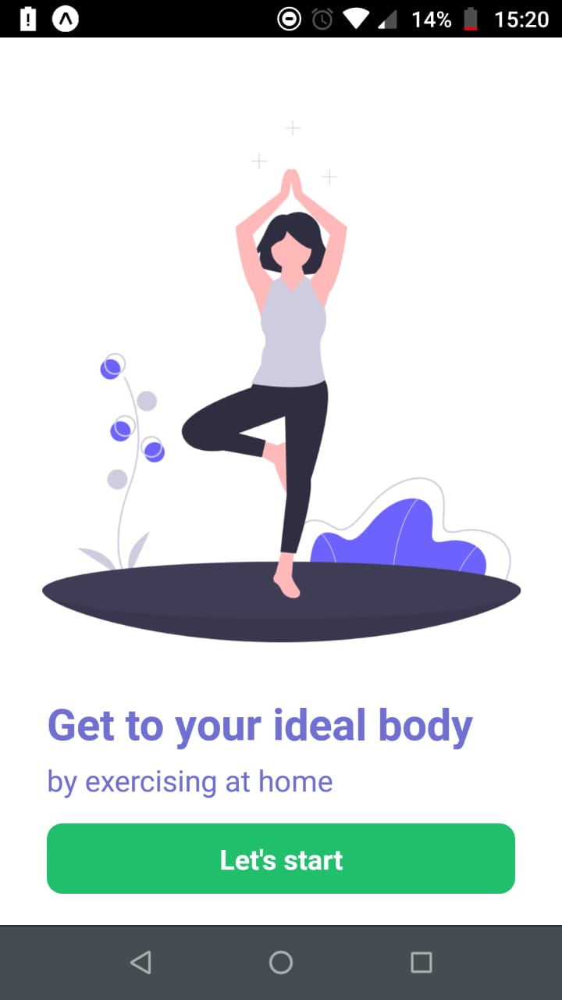
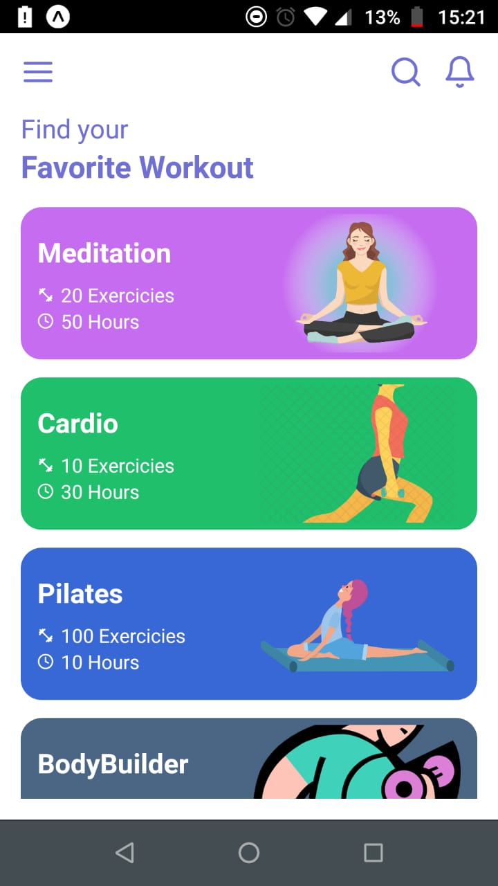
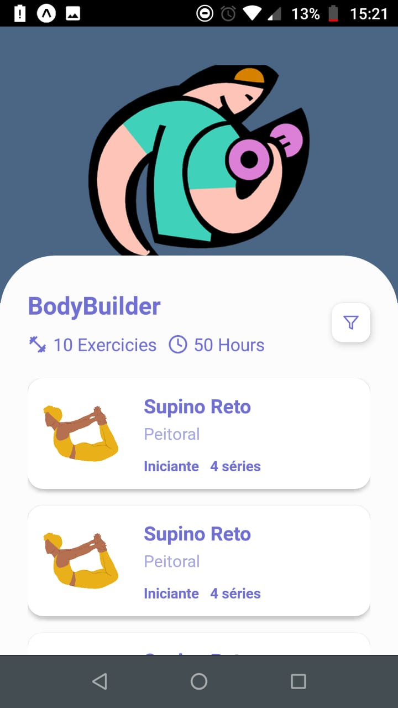

<h1 align="center">Fitness App</h1>

## 💻 O Projeto
Projeto desenvolvido para praticar minhas habilidades React Native.

<h1 align="center" class="teste">
  
  
  
</h1>

## Design
Design feito por [Behnaz Omidvar](https://dribbble.com/shots/9651346-Personal-Training-App/attachments/1679827?mode=media) 

## 🤔 Como contribuir

- Faça um fork desse repositório;
- Cria uma branch com a sua feature: `git checkout -b minha-feature`;
- Faça commit das suas alterações: `git commit -m 'feat: Minha nova feature'`;
- Faça push para a sua branch: `git push origin minha-feature`.

---

Desenvolvido por [William José Dias!](https://github.com/WilliamWJD)

